<figure>

</figure>

To run & manage the **9** PHP application templates (LAMP, LAPP, and LAOP Stacks) in this project on 13 different clouds and virtualization platforms (including vSphere, OpenStack, AWS, Rackspace, Microsoft Azure, Google Compute Engine, DigitalOcean, IBM SoftLayer, etc.), make sure that you either:
-   **Sign Up for FREE on DCHQ.io** -- <http://dchq.io> (no credit card required), or
-   **Download DCHQ On-Premise Standard Edition for FREE** -- <http://dchq.co/dchq-on-premise-download.html>

Customize & Run all the published Docker PHP application templates (including the LAMP, LAPP, and LAOP Stacks) and many other templates (including multi-tier Java application stacks, Mongo Replica Set Cluster, Drupal, Wordpress, MEAN.JS, etc.)

<figure>
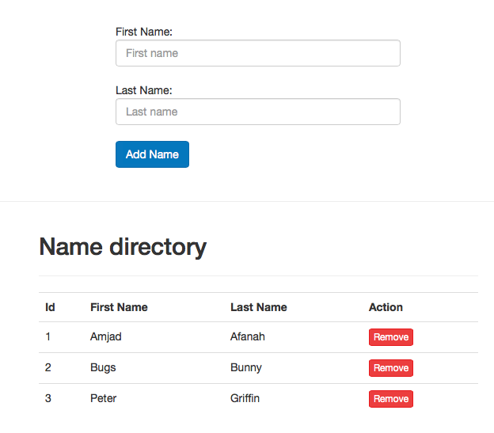
</figure>

**Table of Contents**  

- [DCHQ - Docker PHP Example ](#dchq---docker-php-example-)
- [A Step by Step Guide for Deploying & Managing a PHP Application on Docker-based LAMP, LAPP, and LAOP Stacks](#dchq---docker-php-example-)
	- [Background](#background)
	- [Configuring the config.php the PHP application](#configuring-the-configphp-the-php-application)
	- [Initializing the database for the PHP application](#initializing-the-database-for-the-php-application)
	- [Building the Docker Image Using php:5.6-apache](#building-the-docker-image-using-php56-apache)
	- [Building the YAML-based application templates that can re-used on any Linux host running anywhere](#building-the-yaml-based-application-templates-that-can-re-used-on-any-linux-host-running-anywhere)
		- [Environment Variable Bindings Across Images](#environment-variable-bindings-across-images)
		- [LAMP Stack (Linux-Apache-MySQL-PHP)](#lamp-stack-linux-apache-mysql-php)
		- [LAPP Stack (Linux-Apache-PostgreSQL-PHP)](#lapp-stack-linux-apache-postgresql-php)
		- [LAOP Stack (Linux-Apache-Oracle-XE-PHP)](#laop-stack-linux-apache-oracle-php)
		- [LAMP Stack (3-Tier Nginx-PHP-MySQL)](#lamp-stack-3-tier-nginx-php-mysql)
		- [LAPP Stack (3-Tier Nginx-PHP-PostgreSQL)](#lapp-stack-3-tier-nginx-php-postgresql)
		- [LAOP Stack (3-Tier Nginx-PHP-Oracle-XE)](#laop-stack-3-tier-nginx-php-oracle-xe)
		- [LAMP Stack (3-Tier Apache-HTTP-PHP-MySQL)](#lamp-stack-3-tier-apachehttp-php-mysql)
		- [LAPP Stack (3-Tier Apache-HTTP-PHP-PostgreSQL)](#lapp-stack-3-tier-apachehttp-php-postgresql)
		- [LAOP Stack (3-Tier Apache-HTTP-PHP-Oracle-XE)](#laop-stack-3-tier-apachehttp-php-oracle-xe)
		- [Invoking a plug-in to initialize the database separately on a Docker LAMP Stack](#invoking-a-plug-in-to-initialize-the-database-separately-on-a-docker-lamp-stack)
	- [Provisioning & Auto-Scaling the Underlying Infrastructure on Any Cloud](#provisioning--auto-scaling-the-underlying-infrastructure-on-any-cloud)
	- [Deploying the Multi-Tier PHP Application on the Rackspace Cluster](#deploying-the-multi-tier-php-application-on-the-rackspace-cluster)
	- [Accessing The In-Browser Terminal For The Running Containers](#accessing-the-in-browser-terminal-for-the-running-containers)
	- [Monitoring the CPU, Memory & I/O Utilization of the Running Containers](#monitoring-the-cpu-memory--io-utilization-of-the-running-containers)
	- [Enabling the Continuous Integration Using Automated App Run](#enabling-the-continuous-integration-using-automated-app-run)
	- [Scaling out the PHP application](#scaling-out-the-php-application)
	- [Conclusion](#conclusion)
 

DCHQ - Docker PHP Example 
===========================

 

A Step by Step Guide for Deploying & Managing a PHP Application on Docker-based LAMP, LAPP, and LAOP Stacks
=======================================================================================================================================
 

Background
----------

Containerizing enterprise applications is still a challenge mostly because existing application composition frameworks do not address complex dependencies, external integrations or auto-scaling workflows post-provision. Moreover, the ephemeral design of containers meant that developers had to spin up new containers and re-create the complex dependencies & external integrations with every version update.

DCHQ, available in hosted and on-premise versions, addresses all of these challenges and simplifies the containerization of enterprise applications through an advanced application composition framework that extends Docker Compose with cross-image environment variable bindings, extensible BASH script plug-ins that can be invoked at request time or post-provision, and application clustering for high availability across multiple hosts or regions with support for auto scaling.

Once an application is provisioned, a user can monitor the CPU, Memory, & I/O of the running containers, get notifications & alerts, and get access to application backups, automatic scale in/out workflows, and plug-in execution workflows to update running containers. Moreover, automated "App Run" allows users to integrate their Continuous Integration workflows to schedule the deployment of containers for their nightly builds or whenever changes are merged in GitHub.

In previous blogs, we demonstrated the end-to-end deployment automation of various Java applications (like Pizza Shop and Movie Store apps) on multi-tier Docker-based application stacks across 13 different clouds & virtualization platforms. For full list of these blogs, you can visit this page: <http://dchq.co/docker-java-applications.html>

However many users were still confused on some of the fundamental aspects of application modeling. These questions include:

-   Where do these **environment variables** come from in your YAML-based application template?

-   How is the **database initialized with the proper schemas** needed from my PHP application?

To address these questions, we created a sample “Names Directory” PHP application in this GitHub project that can be deployed on these application stacks:

-   Docker LAMP Stack (Linux-Apache-MySQL-PHP)

-   Docker LAPP Stack (Linux-Apache-PostgreSQL-PHP)

-   Docker LAOP Stack (Linux-Apache-Oracle-PHP)

In this project, we will provide a step-by-step guide for configuring, deploying and managing this PHP application using different application stacks and on different cloud/virtual infrastructure.

We will cover:

-   Configuring the config.php the PHP application

-   Initializing the database for the PHP application

-   Building the Docker Image Using php:5.6-apache

-   Building the YAML-based application templates that can re-used on any Linux host running anywhere

-   Provisioning & auto-scaling the underlying infrastructure on any cloud (with Rackspace being the example in this blog)

-   Deploying the multi-tier PHP application on the Rackspace cluster

-   Monitoring the CPU, Memory & I/O of the Running Containers

-   Enabling the Continuous Integration Using Automated App Run

-   Scaling out the PHP application

 

Configuring the config.php the PHP application
---------------------------------------------------------------------------

You can clone this sample “Names Directory” PHP application from GitHub.

**git clone** <https://github.com/dchqinc/dchq-docker-php-example.git>

This is the most important step in “Dockerizing” your PHP application. In order to leverage the environment variables you can pass when running containers, you will need to make sure that your application is configured in a way that will allow you to change certain properties at request time – like:

-   The database driver you would like to use

-   The database URL

-   The database credentials

-   Any other parameters that you would like to change at request time (e.g. the min/max connection pool size, idle timeout, etc.)

To achieve this, you will first need to configure **config.php**.

<https://github.com/dchqinc/dchq-docker-php-example/blob/master/software/config.php>

~~~~~~~~~~~~~~~~~~~~~~~~~~~~~~~~~~~~~~~~~~~~~~~~~~~~~~~~~~~~~~~~~~~~~~~~~~~~~~~~
    static function getInstance() {

        if (self::$instance == null) {

            $obj = new Config();
            $obj->setHost($_ENV["DB_HOST"]);
            $obj->setUser($_ENV["DB_USER"]);
            $obj->setPass($_ENV["DB_PASS"]);
            $obj->setDatabase($_ENV["DB_NAME"]);
            $obj->setProvider($_ENV["DB_PROVIDER"]);
            $obj->setPort($_ENV["DB_PORT"]);
            self::$instance = $obj;
        }

        return self::$instance;
    }
~~~~~~~~~~~~~~~~~~~~~~~~~~~~~~~~~~~~~~~~~~~~~~~~~~~~~~~~~~~~~~~~~~~~~~~~~~~~~~~~

You will notice that specific data-source properties are referencing the following environment variables that will be passed on at request time:

-   **DB_HOST**

-   **DB_USER**

-   **DB_PASS**

-   **DB_NAME**

-   **DB_PROVIDER**

-   **DB_PORT**

 

Initializing the database for the PHP application
-------------------------------------------------------------

We typically recommend initializing the database schema as part of the PHP application deployment itself. This way, you don’t have to worry about maintaining separate SQL files that need to be executed on the database separately.

However if you already have those SQL files and you still prefer executing them on the database separately – then DCHQ can help you automate this process through its plug-in framework. You can refer to this <a href=#invoking-a-plug-in-to-initialize-the-database-separately-on-a-docker-lamp-stack>section</a> for more information.

In order to include the SQL scripts for creating the database tables in the PHP application, you will need to configure **Persistence.php** file to populate the database using different SQL statements (depending on the database used). The populateDatabase() function works with MySQL, PostgreSQL and Oracle.

<https://github.com/dchqinc/dchq-docker-php-example/blob/master/software/class/Persistence.php>

~~~~~~~~~~~~~~~~~~~~~~~~~~~~~~~~~~~~~~~~~~~~~~~~~~~~~~~~~~~~~~~~~~~~~~~~~~~~~~~~
    public function populateDatabase() {
        //Get default PDO connection instance
        $this->setConnection(PersistenceFactory::getDefault());
        //Diferent creation strings based on provider..
        $providers = array(
            "mysql" => "CREATE TABLE IF NOT EXISTS `directories` (`ID` int(11) NOT NULL AUTO_INCREMENT,`FIRSTNAME` varchar(255) DEFAULT NULL,`LASTNAME` varchar(255) DEFAULT NULL,`ACTIVE` varchar(3) NOT NULL,PRIMARY KEY (`id`)) ENGINE=InnoDB DEFAULT CHARSET=latin1 AUTO_INCREMENT=1",
            "postgresql" => "CREATE TABLE directories (id SERIAL, FIRSTNAME varchar(255), LASTNAME varchar(255), ACTIVE varchar(3))",
            "oraclexe" => "CREATE TABLE directories (ID VARCHAR2(50) PRIMARY KEY NOT NULL,FIRSTNAME VARCHAR2(255), LASTNAME VARCHAR2(255), ACTIVE VARCHAR2(10))");
        try {
            $queryStr = $providers[Config::getInstance()->getProvider()];
            if ($queryStr == null) {
                echo "You have a syntax error in enviroment parameters.";
                exit();
            }
            if (Config::getInstance()->getProvider() == "oraclexe") {
                $query = oci_parse($this->getConnection(), $queryStr);
                @oci_execute($query);
            } else {
                $query = $this->getConnection()->prepare($queryStr);
                $query->execute();
            }
        } catch (PDOException $ex) {
            echo "There was an error creating 'directories' table: " . $ex->getMessage();
        }
    }
~~~~~~~~~~~~~~~~~~~~~~~~~~~~~~~~~~~~~~~~~~~~~~~~~~~~~~~~~~~~~~~~~~~~~~~~~~~~~~~~

 

Building the Docker Image Using php:5.6-apache
-------------------------------------------------------------
Once the PHP application is configured, you simply need to create a Docker image with your PHP code. 

Once logged in to DCHQ (either the hosted DCHQ.io or on-premise version), a user can navigate to **Automate** > **Image Build** and then click on the **+** button to create a new **Dockerfile (Git/GitHub/BitBucket)** image build.

Provide the required values as follows:

-   **Git URL** – https://github.com/dchqinc/dchq-docker-php-example.git

-   **Git Branch** – this field is optional -- but a user can specify a branch from a GitHub project. The default branch is master.

-   **Git Credentials** – a user can store the credentials to a private GitHub repository securely in DCHQ. This can be done by navigating to **Manage** > **Cloud Providers and Repos** and clicking on the **+** to select **Credentials**

-   **Cluster** – the building of Docker images is orchestrated through the DCHQ agent. As a result, a user needs to select a cluster on which an agent will be used to execute the building of Docker images. If a cluster has not been created yet, please refer to this <a href=#provisioning--auto-scaling-the-underlying-infrastructure-on-any-cloud>section</a> to either register already running hosts or automate the provisioning of new virtual infrastructure.

-   **Push to Registry** – a user can push the newly created image on either a public or private repository on Docker Hub or Quay. To register a Docker Hub or Quay account, a user should navigate to **Manage** > **Cloud Providers and Repos** and clicking on the **+** to select **Docker Registries**

-   **Repository** – this is the name of the repository on which the image will be pushed. For example, our image was pushed to **dchq/php-example:latest**

-   **Tag** – this is the tag name that you would like to give for the new image. The supported tag names in DCHQ include:
	
	- **{{date}}** -- formatted date
	
	- **{{timestamp}}** -- the full time-stamp

-   **Cron Expression** – a user can schedule the building of Docker images using out-of-box cron expressions. This facilitates daily and nightly builds for users.

Once the required fields are completed, a user can click **Save**.

A user can then click on the **Play Button** to build the Docker image on-demand.

<figure>
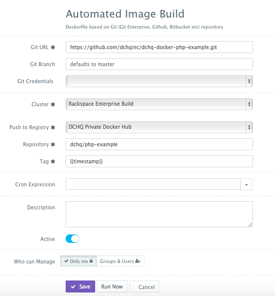
</figure>

Here's the actual Dockerfile used to build this Docker image from this GitHub repository:

~~~~~~~~~~~~~~~~~~~~~~~~~~~~~~~~~~~~~~~~~~~~~~~~~~~~~~~~~~~~~~~~~~~~~~~~~~~~~~~~
FROM php:5.6-apache

MAINTAINER Amjad Afanah (amjad@dchq.io)

RUN apt-get update
RUN apt-get -y install php-pear php5-dev libmysqlclient15-dev libpq-dev
RUN docker-php-ext-install pdo pdo_mysql pdo_pgsql

COPY ./software /var/www/html/

# Oracle instantclient
COPY ./software/oracle/instantclient-basic-linux.x64-11.2.0.4.0.zip /tmp/instantclient-basic-linux.x64-11.2.0.4.0.zip
COPY ./software/oracle/instantclient-sdk-linux.x64-11.2.0.4.0.zip /tmp/instantclient-sdk-linux.x64-11.2.0.4.0.zip
COPY ./software/oracle/instantclient-sqlplus-linux.x64-11.2.0.4.0.zip /tmp/instantclient-sqlplus-linux.x64-11.2.0.4.0.zip
COPY ./software/oracle/tns.ora /etc/tns.ora

RUN apt-get install -y unzip

RUN unzip /tmp/instantclient-basic-linux.x64-11.2.0.4.0.zip -d /usr/local/
RUN unzip /tmp/instantclient-sdk-linux.x64-11.2.0.4.0.zip -d /usr/local/
RUN unzip /tmp/instantclient-sqlplus-linux.x64-11.2.0.4.0.zip -d /usr/local/
RUN ln -s /usr/local/instantclient_11_2 /usr/local/instantclient
RUN ln -s /usr/local/instantclient/libclntsh.so.11.1 /usr/local/instantclient/libclntsh.so
RUN ln -s /usr/local/instantclient/sqlplus /usr/bin/sqlplus

RUN apt-get install libaio-dev -y

ENV LD_LIBRARY_PATH /usr/local/instantclient
ENV TNS_ADMIN       /usr/local/instantclient
ENV ORACLE_BASE     /usr/local/instantclient
ENV ORACLE_HOME     /usr/local/instantclient

RUN echo 'instantclient,/usr/local/instantclient' | pecl install oci8

RUN echo "extension=oci8.so" > /usr/local/etc/php/conf.d/oci8.ini

RUN apt-get clean -y
~~~~~~~~~~~~~~~~~~~~~~~~~~~~~~~~~~~~~~~~~~~~~~~~~~~~~~~~~~~~~~~~~~~~~~~~~~~~~~~~

 

Building the YAML-based application templates that can re-used on any Linux host running anywhere
-------------------------------------------------------------------------------------------------

Once logged in to DCHQ (either the hosted DCHQ.io or on-premise version), a user can navigate to **Manage** > **Templates** and then click on the **+** button to create a new **Docker Compose** template.

We have created **9 application templates** using the **official images from Docker Hub** for the same “Names Directory” PHP application – but for different application servers and databases.

The templates include examples of the following application stacks (for the same PHP application):
-   Docker LAMP Stack (Linux-Apache-MySQL-PHP)
-   Docker LAPP Stack (Linux-Apache-PostgreSQL-PHP)
-   Docker LAOP Stack (Linux-Apache-Oracle-XE-PHP)
-   Docker LAMP Stack (3-Tier Nginx-PHP-MySQL)
-   Docker LAPP Stack (3-Tier Nginx-PHP-PostgreSQL)
-   Docker LAOP Stack (3-Tier Nginx-PHP-Oracle-XE)
-   Docker LAMP Stack (3-Tier Apache-HTTP-PHP-MySQL)
-   Docker LAPP Stack (3-Tier Apache-HTTP-PHP-PostgreSQL)
-   Docker LAOP Stack (3-Tier Apache-HTTP-PHP-Oracle-XE)

### Environment Variable Bindings Across Images

Additionally, a user can create cross-image environment variable bindings by making a reference to another image’s environment variable. In this case, we have made several bindings – including **DB_HOST={{MySQL|container_private_ip}}** – in which the database container IP is resolved dynamically at request time and is used to ensure that the Apache-PHP Server can establish a connection with the database.

Here is a list of supported environment variable values:

-   **{{alphanumeric | 8}}** – creates a random 8-character alphanumeric string. This is most useful for creating random passwords.

-   **{{Image Name | ip}}** – allows you to enter the host IP address of a container as a value for an environment variable. This is most useful for allowing the middleware tier to establish a connection with the database.

-   **{{Image Name | container_ip}}** – allows you to enter the name of a container as a value for an environment variable. This is most useful for allowing the middleware tier to establish a secure connection with the database (without exposing the database port).

-   **{{Image Name | container_private_ip}}** – allows you to enter the internal IP of a container as a value for an environment variable. This is most useful for allowing the middleware tier to establish a secure connection with the database (without exposing the database port).

-   **{{Image Name | port_Port Number}}** – allows you to enter the Port number of a container as a value for an environment variable. This is most useful for allowing the middleware tier to establish a connection with the database. In this case, the port number specified needs to be the internal port number – i.e. not the external port that is allocated to the container. For example, {{PostgreSQL | port_5432}} will be translated to the actual external port that will allow the middleware tier to establish a connection with the database.

-   **{{Image Name | Environment Variable Name}}** – allows you to enter the value an image’s environment variable into another image’s environment variable. The use cases here are endless – as most multi-tier applications will have cross-image dependencies.

 

### LAMP Stack (Linux-Apache-MySQL-PHP)

~~~~~~~~~~~~~~~~~~~~~~~~~~~~~~~~~~~~~~~~~~~~~~~~~~~~~~~~~~~~~~~~~~~~~~~~~~~~~~~~
PHP:
  image: dchq/php-example:latest
  mem_min: 600m
  publish_all: true
  environment:
  - DB_HOST={{MySQL|container_private_ip}}
  - DB_USER={{MySQL|MYSQL_USER}}
  - DB_PASS={{MySQL|MYSQL_ROOT_PASSWORD}}
  - DB_NAME={{MySQL|MYSQL_DATABASE}}
  - DB_PORT=3306
  - DB_PROVIDER=mysql
MySQL:
  image: mysql:latest
  mem_min: 400m
  publish_all: false
  environment:
  - MYSQL_USER=root
  - MYSQL_DATABASE=mysql
  - MYSQL_ROOT_PASSWORD={{alphanumeric | 8}}
~~~~~~~~~~~~~~~~~~~~~~~~~~~~~~~~~~~~~~~~~~~~~~~~~~~~~~~~~~~~~~~~~~~~~~~~~~~~~~~~

 

### LAPP Stack (Linux-Apache-PostgreSQL-PHP)

~~~~~~~~~~~~~~~~~~~~~~~~~~~~~~~~~~~~~~~~~~~~~~~~~~~~~~~~~~~~~~~~~~~~~~~~~~~~~~~~
PHP:
  image: dchq/php-example:latest
  mem_min: 600m
  publish_all: true
  environment:
  - DB_HOST={{Postgres|container_private_ip}}
  - DB_USER={{Postgres|POSTGRES_USER}}
  - DB_PASS={{Postgres|POSTGRES_PASSWORD}}
  - DB_NAME={{Postgres|POSTGRES_DB}}
  - DB_PORT=5432
  - DB_PROVIDER=postgresql
Postgres:
  image: postgres:latest
  publish_all: false
  mem_min: 400m
  environment:
    - POSTGRES_USER=root
    - POSTGRES_PASSWORD={{alphanumeric | 8}}
    - POSTGRES_DB=postgres
~~~~~~~~~~~~~~~~~~~~~~~~~~~~~~~~~~~~~~~~~~~~~~~~~~~~~~~~~~~~~~~~~~~~~~~~~~~~~~~~

 

### LAOP Stack (Linux-Apache-Oracle-PHP)

~~~~~~~~~~~~~~~~~~~~~~~~~~~~~~~~~~~~~~~~~~~~~~~~~~~~~~~~~~~~~~~~~~~~~~~~~~~~~~~~
PHP:
  image: dchq/php-example:latest
  mem_min: 600m
  publish_all: true
  environment:
  - DB_HOST={{Oracle|container_private_ip}}
  - DB_USER={{Oracle|username}}
  - DB_PASS={{Oracle|password}}
  - DB_NAME={{Oracle|sid}}
  - DB_PORT=1521
  - DB_PROVIDER=oraclexe
Oracle:
  image: wnameless/oracle-xe-11g:latest
  publish_all: false
  mem_min: 400m
  environment:
    - username=system
    - password=oracle
    - sid=xe
~~~~~~~~~~~~~~~~~~~~~~~~~~~~~~~~~~~~~~~~~~~~~~~~~~~~~~~~~~~~~~~~~~~~~~~~~~~~~~~~

 

### LAMP Stack (3-Tier Nginx-PHP-MySQL)

~~~~~~~~~~~~~~~~~~~~~~~~~~~~~~~~~~~~~~~~~~~~~~~~~~~~~~~~~~~~~~~~~~~~~~~~~~~~~~~~
Nginx-LB:
  image: nginx:latest
  publish_all: true
  mem_min: 50m
  plugins:
    - !plugin
      id: 0H1Nk
      restart: true
      arguments:
        - servers=server {{PHP | container_ip}}:80;
PHP:
  image: dchq/php-example:latest
  cluster_size: 1
  mem_min: 600m
  publish_all: false
  environment:
  - DB_HOST={{MySQL|container_private_ip}}
  - DB_USER={{MySQL|MYSQL_USER}}
  - DB_PASS={{MySQL|MYSQL_ROOT_PASSWORD}}
  - DB_NAME={{MySQL|MYSQL_DATABASE}}
  - DB_PORT=3306
  - DB_PROVIDER=mysql
MySQL:
  image: mysql:latest
  mem_min: 400m
  publish_all: false
  environment:
  - MYSQL_USER=root
  - MYSQL_DATABASE=mysql
  - MYSQL_ROOT_PASSWORD={{alphanumeric | 8}}
~~~~~~~~~~~~~~~~~~~~~~~~~~~~~~~~~~~~~~~~~~~~~~~~~~~~~~~~~~~~~~~~~~~~~~~~~~~~~~~~

 

### LAPP Stack (3-Tier Nginx-PHP-PostgreSQL)

~~~~~~~~~~~~~~~~~~~~~~~~~~~~~~~~~~~~~~~~~~~~~~~~~~~~~~~~~~~~~~~~~~~~~~~~~~~~~~~~
Nginx-LB:
  image: nginx:latest
  publish_all: true
  mem_min: 50m
  plugins:
    - !plugin
      id: 0H1Nk
      restart: true
      arguments:
        - servers=server {{PHP | container_ip}}:80;
PHP:
  image: dchq/php-example:latest
  mem_min: 600m
  publish_all: false
  environment:
  - DB_HOST={{Postgres|container_private_ip}}
  - DB_USER={{Postgres|POSTGRES_USER}}
  - DB_PASS={{Postgres|POSTGRES_PASSWORD}}
  - DB_NAME={{Postgres|POSTGRES_DB}}
  - DB_PORT=5432
  - DB_PROVIDER=postgresql
Postgres:
  image: postgres:latest
  publish_all: false
  mem_min: 400m
  environment:
    - POSTGRES_USER=root
    - POSTGRES_PASSWORD={{alphanumeric | 8}}
    - POSTGRES_DB=postgres
~~~~~~~~~~~~~~~~~~~~~~~~~~~~~~~~~~~~~~~~~~~~~~~~~~~~~~~~~~~~~~~~~~~~~~~~~~~~~~~~

 

### LAOP Stack (3-Tier Nginx-PHP-Oracle-XE)

~~~~~~~~~~~~~~~~~~~~~~~~~~~~~~~~~~~~~~~~~~~~~~~~~~~~~~~~~~~~~~~~~~~~~~~~~~~~~~~~
Nginx-LB:
  image: nginx:latest
  publish_all: true
  mem_min: 50m
  plugins:
    - !plugin
      id: 0H1Nk
      restart: true
      arguments:
        - servers=server {{PHP | container_ip}}:80;
PHP:
  image: dchq/php-example:latest
  mem_min: 600m
  publish_all: false
  environment:
  - DB_HOST={{Oracle|container_private_ip}}
  - DB_USER={{Oracle|username}}
  - DB_PASS={{Oracle|password}}
  - DB_NAME={{Oracle|sid}}
  - DB_PORT=1521
  - DB_PROVIDER=oraclexe
Oracle:
  image: wnameless/oracle-xe-11g:latest
  publish_all: false
  mem_min: 400m
  environment:
    - username=system
    - password=oracle
    - sid=xe
~~~~~~~~~~~~~~~~~~~~~~~~~~~~~~~~~~~~~~~~~~~~~~~~~~~~~~~~~~~~~~~~~~~~~~~~~~~~~~~~

 

### LAMP Stack (3-Tier ApacheHTTP-PHP-MySQL)

~~~~~~~~~~~~~~~~~~~~~~~~~~~~~~~~~~~~~~~~~~~~~~~~~~~~~~~~~~~~~~~~~~~~~~~~~~~~~~~~
HTTP-LB:
  image: httpd:latest
  publish_all: true
  mem_min: 50m
  plugins:
    - !plugin
      id: uazUi
      restart: true
      arguments:
        - BalancerMembers=BalancerMember http://{{PHP | container_ip}}:80
PHP:
  image: dchq/php-example:latest
  cluster_size: 1
  mem_min: 600m
  publish_all: false
  environment:
  - DB_HOST={{MySQL|container_private_ip}}
  - DB_USER={{MySQL|MYSQL_USER}}
  - DB_PASS={{MySQL|MYSQL_ROOT_PASSWORD}}
  - DB_NAME={{MySQL|MYSQL_DATABASE}}
  - DB_PORT=3306
  - DB_PROVIDER=mysql
MySQL:
  image: mysql:latest
  mem_min: 400m
  publish_all: false
  environment:
  - MYSQL_USER=root
  - MYSQL_DATABASE=mysql
  - MYSQL_ROOT_PASSWORD={{alphanumeric | 8}}
~~~~~~~~~~~~~~~~~~~~~~~~~~~~~~~~~~~~~~~~~~~~~~~~~~~~~~~~~~~~~~~~~~~~~~~~~~~~~~~~

 

### LAPP Stack (3-Tier ApacheHTTP-PHP-PostgreSQL)

~~~~~~~~~~~~~~~~~~~~~~~~~~~~~~~~~~~~~~~~~~~~~~~~~~~~~~~~~~~~~~~~~~~~~~~~~~~~~~~~
HTTP-LB:
  image: httpd:latest
  publish_all: true
  mem_min: 50m
  plugins:
    - !plugin
      id: uazUi
      restart: true
      arguments:
        - BalancerMembers=BalancerMember http://{{PHP | container_ip}}:80
PHP:
  image: dchq/php-example:latest
  mem_min: 600m
  publish_all: false
  environment:
  - DB_HOST={{Postgres|container_private_ip}}
  - DB_USER={{Postgres|POSTGRES_USER}}
  - DB_PASS={{Postgres|POSTGRES_PASSWORD}}
  - DB_NAME={{Postgres|POSTGRES_DB}}
  - DB_PORT=5432
  - DB_PROVIDER=postgresql
Postgres:
  image: postgres:latest
  publish_all: false
  mem_min: 400m
  environment:
    - POSTGRES_USER=root
    - POSTGRES_PASSWORD={{alphanumeric | 8}}
    - POSTGRES_DB=postgres
~~~~~~~~~~~~~~~~~~~~~~~~~~~~~~~~~~~~~~~~~~~~~~~~~~~~~~~~~~~~~~~~~~~~~~~~~~~~~~~~

 

### LAOP Stack (3-Tier ApacheHTTP-PHP-Oracle-XE)

~~~~~~~~~~~~~~~~~~~~~~~~~~~~~~~~~~~~~~~~~~~~~~~~~~~~~~~~~~~~~~~~~~~~~~~~~~~~~~~~
HTTP-LB:
  image: httpd:latest
  publish_all: true
  mem_min: 50m
  plugins:
    - !plugin
      id: uazUi
      restart: true
      arguments:
        - BalancerMembers=BalancerMember http://{{PHP | container_ip}}:80
PHP:
  image: dchq/php-example:latest
  mem_min: 600m
  publish_all: false
  environment:
  - DB_HOST={{Oracle|container_private_ip}}
  - DB_USER={{Oracle|username}}
  - DB_PASS={{Oracle|password}}
  - DB_NAME={{Oracle|sid}}
  - DB_PORT=1521
  - DB_PROVIDER=oraclexe
Oracle:
  image: wnameless/oracle-xe-11g:latest
  publish_all: false
  mem_min: 400m
  environment:
    - username=system
    - password=oracle
    - sid=xe
~~~~~~~~~~~~~~~~~~~~~~~~~~~~~~~~~~~~~~~~~~~~~~~~~~~~~~~~~~~~~~~~~~~~~~~~~~~~~~~~

 

### Invoking a plug-in to initialize the database separately on a Docker LAMP Stack

We recommend initializing the database schema as part of the PHP application deployment itself. However if you still prefer executing the SQL files on the database separately – then DCHQ can help you automate this process through its plug-in framework.

In this example, MySQL in this LAMP stack is invoking a BASH script plug-in to execute the populate.sql file. The BASH script plug-in was created by navigating to **Manage > Plug-ins** and looks something like this:

~~~~~~~~~~~~~~~~~~~~~~~~~~~~~~~~~~~~~~~~~~~~~~~~~~~~~~~~~~~~~~~~~~~~~~~~~~~~~~~~
#!/bin/bash

apt-get update
apt-get -y install wget
cd /
wget $file_url
/usr/bin/mysql -u $MYSQL_USER -p$MYSQL_ROOT_PASSWORD -h127.0.0.1 $MYSQL_DATABASE < /populate.sql
~~~~~~~~~~~~~~~~~~~~~~~~~~~~~~~~~~~~~~~~~~~~~~~~~~~~~~~~~~~~~~~~~~~~~~~~~~~~~~~~

In this BASH script plug-in, **$MYSQL_USER**, **$MYSQL_ROOT_PASSWORD**, and **$MYSQL_DATABASE** are environment variables that are passed at request time.

**$file_url** is an overrideable argument that you can define when creating the plug-in or when requesting the application. This will be the URL for the populate.sql file.

 

Provisioning & Auto-Scaling the Underlying Infrastructure on Any Cloud
----------------------------------------------------------------------

Once an application is saved, a user can register a Cloud Provider to automate the provisioning and auto-scaling of clusters on 12 different cloud end-points including VMware vSphere, OpenStack, CloudStack, Amazon Web Services, Rackspace, Microsoft Azure, DigitalOcean, IBM SoftLayer, Google Compute Engine, and many others.

First, a user can register a Cloud Provider for Rackspace (for example) by navigating to **Manage** > **Cloud Providers & Repos** and then clicking on the **+** button to select **Rackspace**. The Rackspace API Key needs to be provided – which can be retrieved from the Account Settings section of the Rackspace Cloud Control Panel.

<figure>
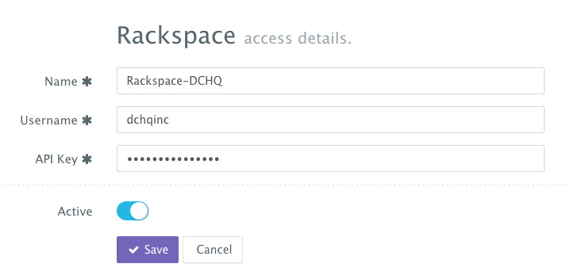
</figure>

A user can then create a cluster with an auto-scale policy to automatically spin up new Cloud Servers. This can be done by navigating to **Manage** > **Clusters** page and then clicking on the **+** button. You can select a capacity-based placement policy and then **Weave** as the networking layer in order to facilitate secure, password-protected cross-container communication across multiple hosts within a cluster. The **Auto-Scale Policy** for example, may set the maximum number of VM’s (or Cloud Servers) to 10.

<figure>
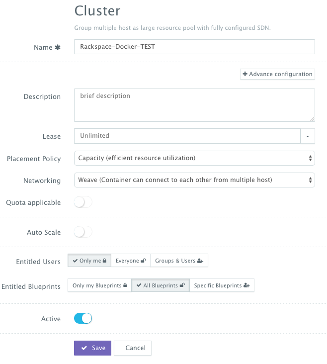
</figure>

A user can now provision a number of Cloud Servers on the newly created cluster either through the UI-based workflow or by defining a simple YAML-based Machine Compose template that can be requested from the Self-Service Library.

**UI-based Workflow** – A user can request Rackspace Cloud Servers by navigating to **Manage** > **Hosts** and then clicking on the **+** button to select **Rackspace**. Once the Cloud Provider is selected, a user can select the region, size and image needed. Ports are opened by default on Rackspace Cloud Servers to accommodate some of the port requirements (e.g. 32000-59000 for Docker, 6783 for Weave, and 5672 for RabbitMQ). A Cluster is then selected and the number of Cloud Servers can be specified.

<figure>
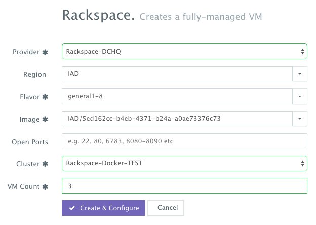
</figure>

**YAML-based Machine Compose Template** – A user can first create a Machine Compose template for Rackspace by navigating to **Manage** > **Templates** and then selecting **Machine Compose**.

Here’s the template for requesting a 4GB Cloud Server.

~~~~~~~~~~~~~~~~~~~~~~~~~~~~~~~~~~~~~~~~~~~~~~~~~~~~~~~~~~~~~~~~~~~~~~~~~~~~~~~~
Medium:
  region: IAD
  description: Rackspace small instance
  instanceType: general1-4
  image: IAD/5ed162cc-b4eb-4371-b24a-a0ae73376c73
  count: 1
~~~~~~~~~~~~~~~~~~~~~~~~~~~~~~~~~~~~~~~~~~~~~~~~~~~~~~~~~~~~~~~~~~~~~~~~~~~~~~~~

<figure>
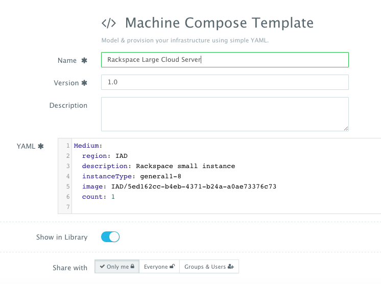
</figure>

The supported parameters for the Machine Compose template are summarized below:

-   **description**: Description of the blueprint/template

-   **instanceType**: Cloud provider specific value (e.g. general1-4)

-   **region**: Cloud provider specific value (e.g. IAD)

-   **image**: Mandatory - fully qualified image ID/name (e.g. IAD/5ed162cc-b4eb-4371-b24a-a0ae73376c73 or vSphere VM Template name)

-   **username**: Optional - only for vSphere VM Template username

-   **password**: Optional - only for vSphere VM Template encrypted password. You can encrypt the password using the endpoint <https://www.dchq.io/#/encrypt>

-   **network**: Optional – Cloud provider specific value (e.g. default)

-   **securityGroup**: Cloud provider specific value (e.g. dchq-security-group)

-   **keyPair**: Cloud provider specific value (e.g. private key)

-   **openPorts**: Optional - comma separated port values

-   **count**: Total no of VM's, defaults to 1.

Once the Machine Compose template is saved, a user can request this machine from the Self-Service **Library**. A user can click **Customize** and then select the **Cloud Provider** and **Cluster** to use for provisioning these Rackspace Cloud Servers.

 

Deploying the Multi-Tier PHP Application on the Rackspace Cluster
------------------------------------------------------------------

Once the Cloud Servers are provisioned, a user can deploy a multi-tier, Docker-based PHP applications on the new Cloud Servers. This can be done by navigating to the Self-Service Library and then clicking on Customize to request a multi-tier application.

A user can select an Environment Tag (like DEV or QE) and the Rackspace Cluster created before clicking on Run.

<figure>
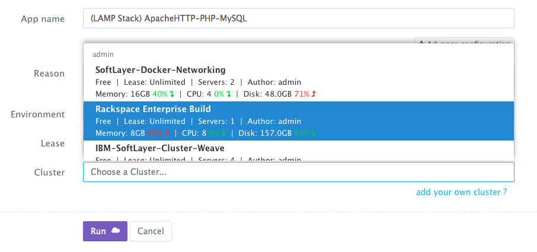
</figure>

Accessing The In-Browser Terminal For The Running Containers
------------------------------------------------------------

A command prompt icon should be available next to the containers’ names on the Live Apps page. This allows users to enter the container using a secure communication protocol through the agent message queue. A white list of commands can be defined by the Tenant Admin to ensure that users do not make any harmful changes on the running containers.

For the PHP deployment for example, we used the command prompt to make sure that the PHP code is indeed under the /var/www/html/ directory.

<figure>
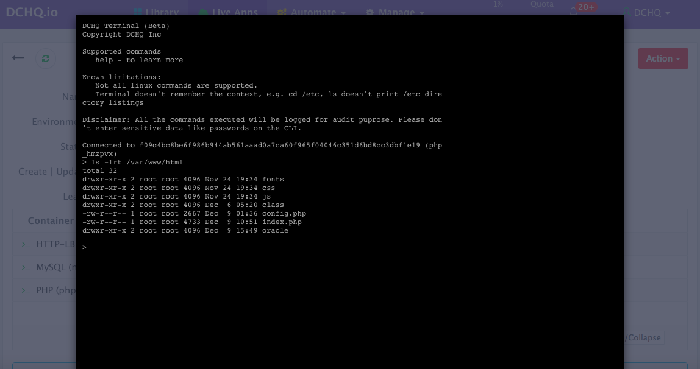
</figure>

Monitoring the CPU, Memory & I/O Utilization of the Running Containers
----------------------------------------------------------------------

Once the application is up and running, our developers monitor the CPU, Memory, & I/O of the running containers to get alerts when these metrics exceed a pre-defined threshold. This is especially useful when our developers are performing functional & load testing.

A user can perform historical monitoring analysis and correlate issues to container updates or build deployments. This can be done by clicking on the **Actions** menu of the running application and then on **Monitoring**. A custom date range can be selected to view CPU, Memory and I/O historically.

<figure>
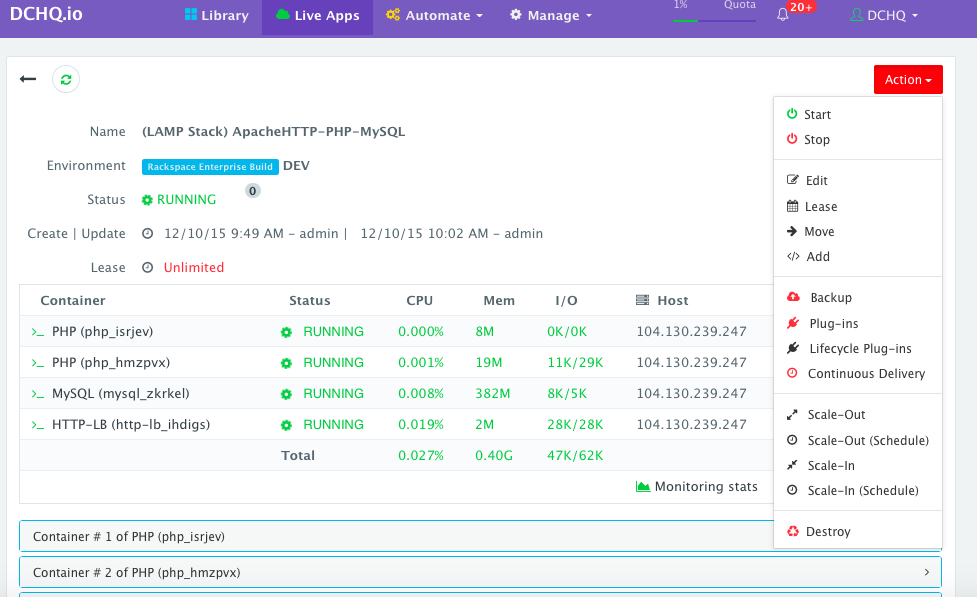
</figure>

<figure>
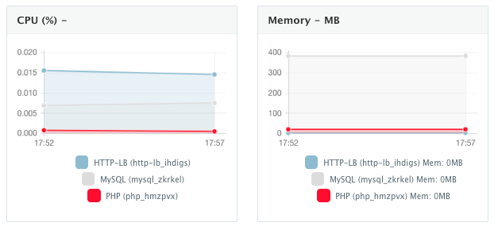
</figure>

Enabling the Continuous Integration Using Automated App Run
----------------------------------------------------------------------------------------------------------------------------------

For developers wishing to follow the “immutable” containers model by rebuilding Docker images containing the application code and spinning up new containers with every application update, DCHQ provides an automated image build and automated app run features that allow developers to automatically create Docker images from Dockerfiles or private GitHub projects containing Dockerfiles, and then spin up full LAMP stacks using the latest images by scheduling the application deployment and customizing the application lease.

As explained in the Docker image build <a href="#building-the-docker-image-using-php56-apache">section</a>, a user can schedule two parallel builds for the PHP image (that's based on <a href="https://hub.docker.com/_/php/"> php:5.6-apache</a>).

-   **latest**: one build will constantly override the latest tag with the latest changes committed to your GitHub project

-   **{{date}}** or **{{timestamp}}**: a parallel build that will back up all the images created using either a formatted date or time-stamp for the tag name

A user can then navigate to **Automate** > **App Run** and then click on the **+** button to create a new "Automated App Run" policy. A user can then complete the required fields - like:

-   **App Name**: the name that will be given to the application deployed

-   **Lease**: by default, an unlimited lease is selected. However an automated app run is most useful for DEV/TEST environments where users are expecting an already running application with the latest code every time they walk into the office in the morning. For that, users can provide a lease of 1-day or 1-week -- depending on their needs.

-   **Blueprint**: a user can search for an already created YAML-based application template (or blueprint) -- similar to the examples given in this project.

-   **Cluster**: this is the cluster on which the application will be deployed. A user will only see a list of clusters to which he/she has been given access to.
   
-   **Cron Expression**: the application deployment can be scheduled using these simple cron expressions. For example, 0 45 15 ? * MON-FRI will fire off the application deployment at 3:45pm UTC time between Monday-Friday.

-   **Who Can Manage**: a user can provide granular entitlements here to dictate who else can manage this "App Run" policy.

<figure>
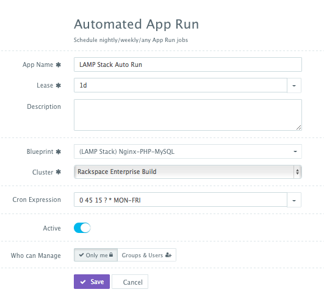
</figure>

 

Scaling out the PHP application
-------------------------------------------------

If the running application becomes resource constrained, a user can to scale out the application to meet the increasing load. Moreover, a user can schedule the scale out during business hours and the scale in during weekends for example.

To scale out the cluster of PHP containers from 1 to 2, a user can click on the **Actions** menu of the running application and then select **Scale Out**. A user can then specify the new size for the cluster and then click on **Run Now**.

<figure>
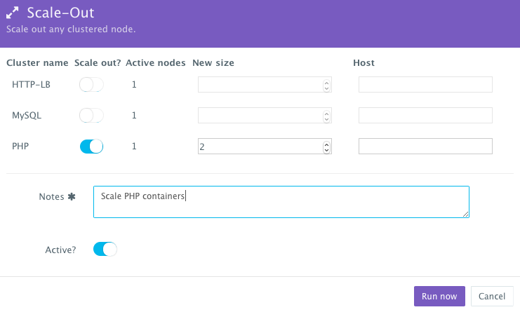
</figure>

We then used the BASH plug-in to update Apache HTTP Server's httpd.conf file so that it’s aware of the new application server added. The BASH script plug-ins can also be scheduled to accommodate use cases like cleaning up logs or updating configurations at defined frequencies. 

To execute a plug-in on a running container, a user can click on the **Actions** menu of the running application and then select **Plug-ins**. A user can then select the load balancer (Apache HTTP Server) container, search for the plug-in that needs to be executed, enable container restart using the toggle button. The default argument for this plug-in will dynamically resolve all the container IP’s of the running PHP containers and add them as part of the httpd.conf file.

<figure>
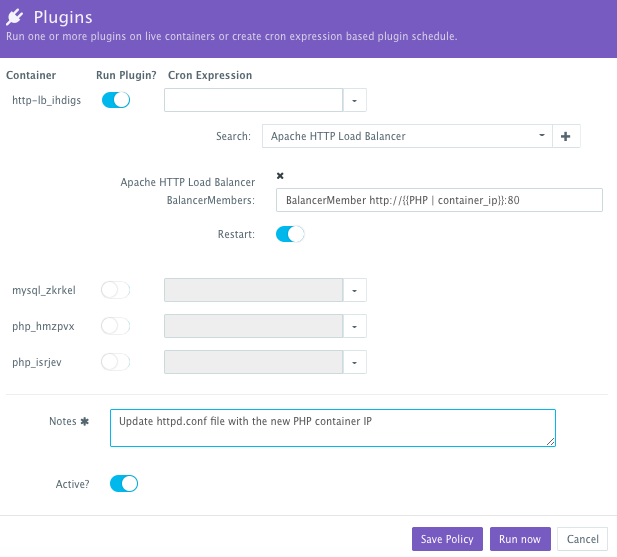
</figure>

An application time-line is available to track every change made to the application for auditing and diagnostics. This can be accessed from the expandable menu at the bottom of the page of a running application.

<figure>
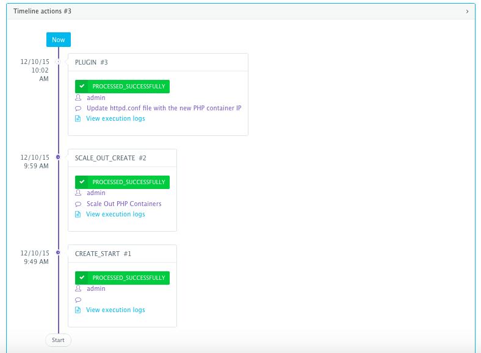
</figure>

Alerts and notifications are available for when containers or hosts are down or when the CPU & Memory Utilization of either hosts or containers exceed a defined threshold.

 

Conclusion
----------

Containerizing enterprise PHP applications is still a challenge mostly because existing application composition frameworks do not address complex dependencies, external integrations or auto-scaling workflows post-provision. 

DCHQ, available in hosted and on-premise versions, addresses all of these challenges and simplifies the containerization of enterprise PHP applications through an advance application composition framework that facilitates cross-image environment variable bindings, extensible BASH script plug-ins that can be invoked at request time or post-provision, and application clustering for high availability across multiple hosts or regions with support for auto scaling.

Sign Up for FREE on <http://DCHQ.io> or download [DCHQ On-Premise](<http://dchq.co/dchq-on-premise.html>) to get access to out-of-box multi-tier Java application templates along with application lifecycle management functionality like monitoring, container updates, scale in/out and continuous delivery.

